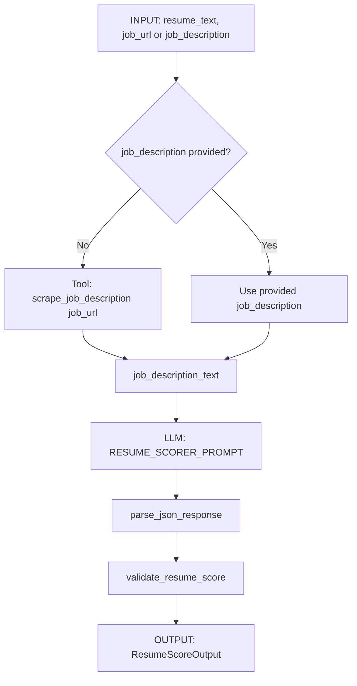
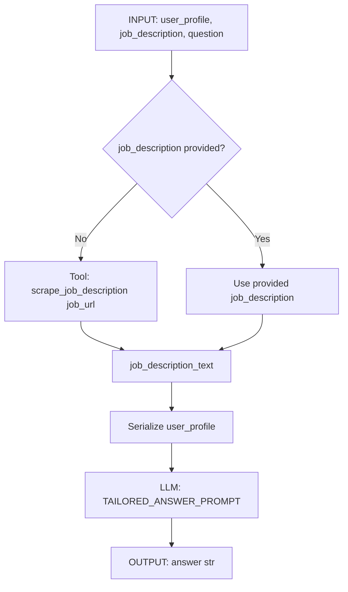
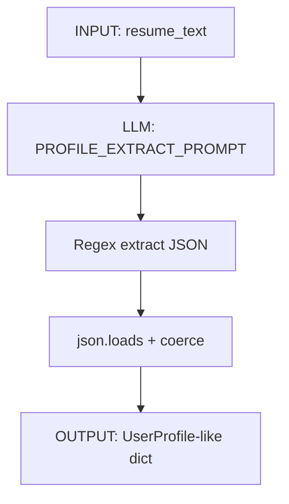
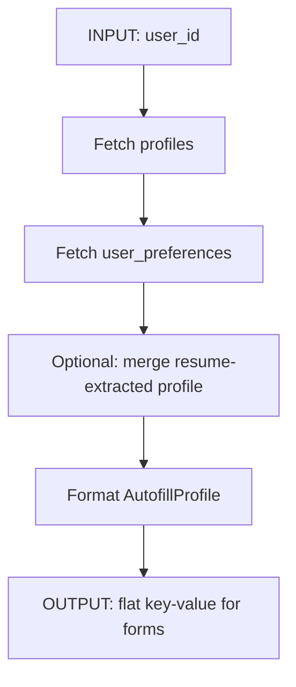

# Agentic Workflows Design

This document specifies the **tools**, **data**, and **LLM prompting strategies** required to deliver the product's core features. It extends `DATA_SCIENCE_DESIGN.md` with a complete agentic workflow specification.

---

## 1. Product Core Features → Agent Workflows

| Feature | Workflow | Status | Primary Tools |
|---------|----------|--------|---------------|
| **Autofill Agent** | Profile → Autofill-ready fields | Design | `get_profile_for_autofill`, (browser extension) |
| **Resume-to-JD Scoring** | Resume vs job analysis | Implemented | `scrape_job`, `analyze_resume_and_jd` |
| **Tailored Answer Agent** | Generate application answers | Implemented | `scrape_job`, `generate_tailored_answer` |
| **Profile Extraction** | Resume → structured profile | Implemented | `extract_profile_from_resume` |
| **Job Scraping** | URL → job description text | Implemented | `scrape_job_description` |
| **Multi-Tool Agent** | Natural-language orchestration | Optional (SmolAgents) | All tools combined |

---

## 2. Tools Specification

### 2.1 `scrape_job_description` (scrape_job)

| Attribute | Value |
|-----------|-------|
| **Purpose** | Fetch full job description text from a job posting URL |
| **Input** | `job_url: str` (e.g. LinkedIn, Indeed, Greenhouse, Glassdoor) |
| **Output** | Plain text (or structured JSON in future) |
| **Implementation** | `model/job_scraper.py` |
| **Dependencies** | `BROWSERLESS_URL` for LinkedIn/Glassdoor (JS rendering) |
| **Error handling** | Returns empty string or raises; caller wraps in `{"success": False, "error": "..."}` |

**Behavior:**
- Uses Beautiful Soup + requests for static pages
- Uses Playwright (Browserless) for LinkedIn, Glassdoor (JS-heavy)
- Site-specific selectors in `JobScraper.SITE_SELECTORS`
- Detects login walls and returns empty/error

---

### 2.2 `analyze_resume_and_jd`

| Attribute | Value |
|-----------|-------|
| **Purpose** | Compare resume vs job description; return match score + actionable suggestions |
| **Input** | `resume_text: str`, `job_description: str` (or scrape first via orchestration) |
| **Output** | `ResumeScoreOutput` (score, match_percentage, suggestions, matched_keywords, missing_keywords) |
| **Implementation** | `model/resume_analyzer.py` + `model/agents.py` (orchestration) |
| **LLM** | OpenAI-compatible; temp 0.3 (structured output) |

**Behavior:**
- Orchestration: if `job_description` missing, calls `scrape_job_description(job_url)` first
- LLM prompt → raw JSON → `parse_json_response` → `validate_resume_score`
- Validator normalizes legacy formats (e.g. `suggestions` as strings)

---

### 2.3 `generate_tailored_answer`

| Attribute | Value |
|-----------|-------|
| **Purpose** | Generate personalized answer to application question using profile + JD |
| **Input** | `user_profile: Dict`, `job_description: str`, `question: str` |
| **Output** | Plain text (150–250 words) |
| **Implementation** | `model/answer_generator.py`, `model/agents.py` |
| **LLM** | OpenAI-compatible; temp 0.7 (creative) |

**Behavior:**
- Orchestration: if `job_description` missing, calls `scrape_job_description(job_url)` first
- Serializes `user_profile` to string for prompt
- Single LLM call; no parsing

---

### 2.4 `extract_profile_from_resume`

| Attribute | Value |
|-----------|-------|
| **Purpose** | Extract structured profile (work_history, skills, education) from raw resume text |
| **Input** | `resume_text: str` |
| **Output** | `{"work_history", "skills", "education", "additional_info"}` (strings) |
| **Implementation** | `model/resume_extractor.py` |
| **LLM** | OpenAI-compatible; temp 0.2 (deterministic) |

**Behavior:**
- Inline prompt in `resume_extractor.py`; should be moved to `prompts.py` for consistency
- Regex extract JSON from response; fallback on parse error

---

### 2.5 `get_profile_for_autofill` (NEW – Design)

| Attribute | Value |
|-----------|-------|
| **Purpose** | Return user profile in autofill-friendly format for forms |
| **Input** | `user_id: str` (Supabase auth.uid()) |
| **Output** | `AutofillProfile` (see Data Contracts) |
| **Implementation** | Backend API + Supabase; no LLM |
| **Source** | `profiles` + `user_preferences` + optional resume-extracted data |

**Behavior:**
- Reads `profiles` (first_name, last_name, email)
- Reads `user_preferences` (roles, locations, skills, etc.)
- Optional: merge with last `extract_profile_from_resume` result per user
- Returns flat key-value structure for clipboard or browser extension

---

## 3. Data Contracts

### 3.1 UserProfile (Tailored Answer & Extraction)

```python
# model/contracts.py
UserProfile = {
    "work_history": List[WorkHistoryEntry] | str,
    "skills": List[str] | str,
    "education": List[EducationEntry] | str,
    "certifications": List[str],
    "summary": str,
    "additional_info": str
}

WorkHistoryEntry = {
    "company": str,
    "position": str,
    "duration": str,
    "responsibilities": List[str],
    "achievements": List[str]
}

EducationEntry = {
    "institution": str,
    "degree": str,
    "field": str,
    "graduation_year": int
}
```

**API:** Accepts loose dict; normalizers convert for prompt.

---

### 3.2 ResumeScoreOutput

```python
# model/contracts.py
ResumeScoreOutput = {
    "score": int,              # 0-100
    "match_percentage": float, # 0.0-1.0
    "suggestions": [
        {"category": "skills"|"experience"|"keywords", "suggestion": str, "priority": "high"|"medium"|"low"}
    ],
    "matched_keywords": List[str],
    "missing_keywords": List[str],
    # Optional backward compat:
    "strengths": List[str],
    "missing_skills": List[str]
}
```

---

### 3.3 AutofillProfile (NEW – Design)

```python
# For GET /api/profile/autofill
AutofillProfile = {
    "first_name": str,
    "last_name": str,
    "full_name": str,
    "email": str,
    "phone": str,           # if stored
    "linkedin_url": str,    # if stored
    "location": str,        # from user_preferences.locations
    "current_title": str,   # from work_history or preferences
    "skills": str,          # comma-separated
    "education_summary": str,
    "work_history_summary": str,
    "expected_salary": str, # if user wants to expose
    "availability": str     # e.g. "2 weeks notice"
}
```

**Storage:** `profiles`, `user_preferences`, optional `resume_profiles` table.

---

### 3.4 Scraper Output

- **Current:** `scrape_job_description(url)` → plain text
- **Optional future:** `{"title", "company", "description", "requirements", "url"}` (see `contracts.scraper_output_schema()`)

---

## 4. LLM Prompting Strategies

### 4.1 Resume Scorer

| Aspect | Strategy |
|--------|----------|
| **Role** | Expert ATS and resume analyzer |
| **Structure** | System: "Output only valid JSON" + User: RESUME_SCORER_PROMPT |
| **Format** | Explicit JSON example in prompt; rules for score, match_percentage, suggestions, categories, priorities |
| **Token limits** | Truncate resume to 4000 chars, JD to 4000 chars |
| **Temperature** | 0.3 (consistent structured output) |
| **Post-processing** | `parse_json_response` → `validate_resume_score` |

**Prompt location:** `model/prompts.py` → `RESUME_SCORER_PROMPT`, `format_resume_scorer_prompt()`

---

### 4.2 Tailored Answer

| Aspect | Strategy |
|--------|----------|
| **Role** | Expert career coach |
| **Structure** | System: career coach persona; User: CANDIDATE PROFILE + JOB DESCRIPTION + QUESTION |
| **Format** | Free-form text; guidelines: 150–250 words, specific, metrics, authentic |
| **Token limits** | JD truncated to 4000 chars |
| **Temperature** | 0.7 (creative, personable) |
| **Post-processing** | None (return raw text) |

**Prompt location:** `model/prompts.py` → `TAILORED_ANSWER_PROMPT`, `format_tailored_answer_prompt()`

---

### 4.3 Profile Extraction

| Aspect | Strategy |
|--------|----------|
| **Role** | Information extractor (no persona) |
| **Structure** | Single user message: RESUME + "Return valid JSON only" |
| **Format** | JSON with keys: work_history, skills, education, additional_info |
| **Token limits** | Resume truncated to 6000 chars |
| **Temperature** | 0.2 (deterministic extraction) |
| **Post-processing** | Regex `\{.*\}` → `json.loads` → coerce to string values |

**Prompt location:** Inline in `resume_extractor.py`; recommend moving to `prompts.py` → `PROFILE_EXTRACT_PROMPT`

---

### 4.4 Consistency Best Practices

- **Few-shot:** Resume scorer uses one explicit JSON example; reduces format drift
- **Validation:** Always validate LLM output (parsers + validators)
- **Fallbacks:** Resume scorer has fallback structure if parse/validate fails
- **Logging:** Log prompt lengths, token usage, and parse errors (no bare `print`)

---

## 5. Workflow Diagrams

### 5.1 Resume-to-JD Scoring Workflow



### 5.2 Tailored Answer Workflow



### 5.3 Profile Extraction Workflow



### 5.4 Autofill Workflow (Design)



### 5.5 Multi-Tool Agent (SmolAgents)

```mermaid
flowchart TD
    A[User: "Scrape X and analyze my resume: ..."] --> B[ToolCallingAgent]
    B --> C{Choose tool}
    C -->|scrape_job| D[scrape_job url]
    C -->|analyze_resume| E[analyze_resume resume_text, job_description]
    C -->|extract_profile| F1[extract_profile resume_text]
    C -->|generate_answer| F2[generate_answer question, profile, job_description]
    D --> G[Return job text]
    E --> H[Return JSON analysis]
    F1 --> H1[Return UserProfile JSON]
    F2 --> I[Return answer]
    G --> B
    H --> B
    H1 --> B
    I --> B
    B --> J[Final output to user]
```

---

## 6. API Interface Summary

| Endpoint | Input | Output | Workflow |
|----------|-------|--------|----------|
| `POST /api/resume/analyze` | resume_text, job_url or job_description | ResumeScoreOutput | Resume-to-JD |
| `POST /api/generate/answer` | question, user_profile, job_url or job_description | `{answer}` | Tailored Answer |
| `POST /api/resume/extract` | resume_text | work_history, skills, education, additional_info | Profile Extraction |
| `POST /api/job/scrape` | job_url | `{success, text, url}` | Job Scraping |
| `GET /api/profile/autofill` *(new)* | (auth header) | AutofillProfile | Autofill |
| `POST /api/agent/run` | task (natural language) | `{success, output}` | Multi-Tool Agent |

---

## 7. Implementation Checklist

### Tools
- [x] `scrape_job_description` – `job_scraper.py`
- [x] `analyze_resume_and_jd` – `resume_analyzer.py`, `agents.py`
- [x] `generate_tailored_answer` – `answer_generator.py`, `agents.py`
- [x] `extract_profile_from_resume` – `resume_extractor.py`
- [x] `get_profile_for_autofill` – `GET /api/profile/autofill` (Next.js API route)

### Data Contracts
- [x] UserProfile – `contracts.py`
- [x] ResumeScoreOutput – `contracts.py`, `validators.py`
- [x] AutofillProfile – `ai_job_frontend/src/types/profile.ts`

### LLM Prompts
- [x] RESUME_SCORER_PROMPT – `prompts.py`
- [x] TAILORED_ANSWER_PROMPT – `prompts.py`
- [x] PROFILE_EXTRACT_PROMPT – `prompts.py` (centralized; used by resume_extractor)

### Optional
- [x] SmolAgents multi-tool agent – `model/agents/job_assistant_agent.py`
- [x] Add `extract_profile` tool to SmolAgents agent
- [ ] Autofill: copy-to-clipboard UI or browser extension

---

## 8. Configuration

| Env Variable | Role |
|--------------|------|
| `OPENAI_API_KEY` | LLM API key |
| `OPENAI_BASE_URL` | API base (OpenAI, Azure, DeepSeek) |
| `OPENAI_MODEL` | Model name |
| `BROWSERLESS_URL` | Playwright for LinkedIn/Glassdoor |
| `LOG_LEVEL` | Logging verbosity |

See `model/utils/config.py` and `AZURE_DEEPSEEK_SETUP.md`.
