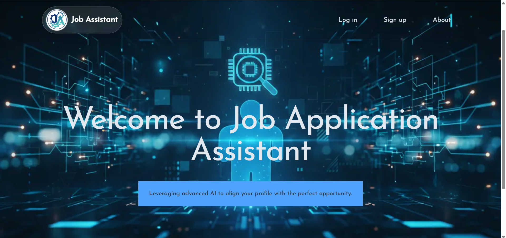
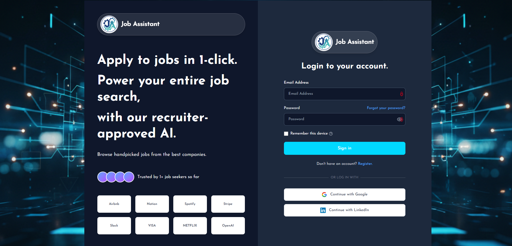
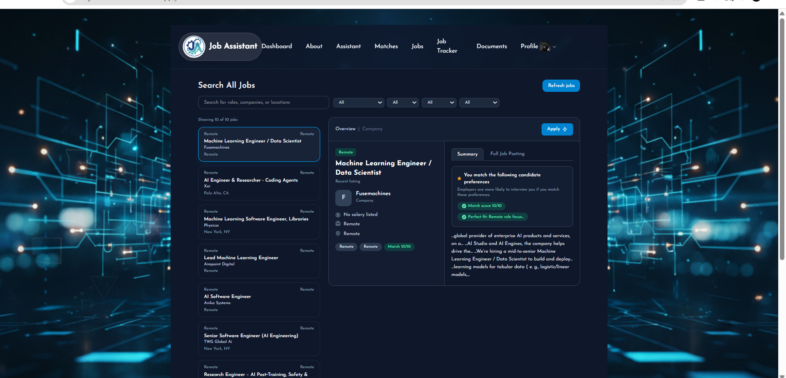
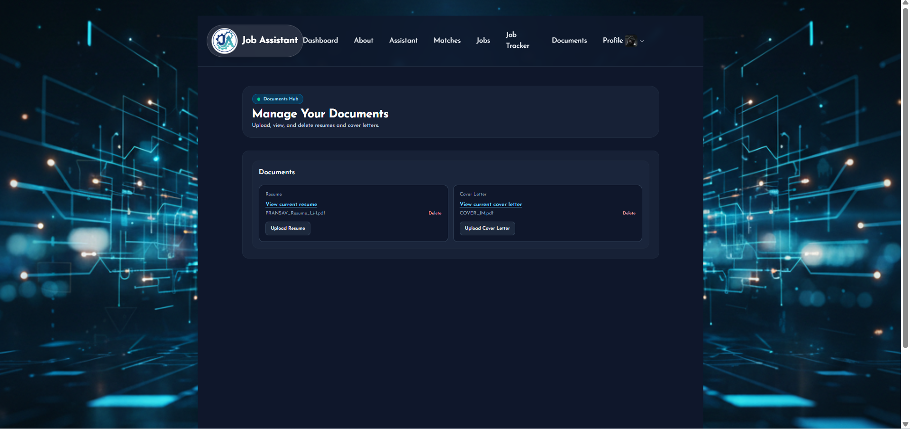
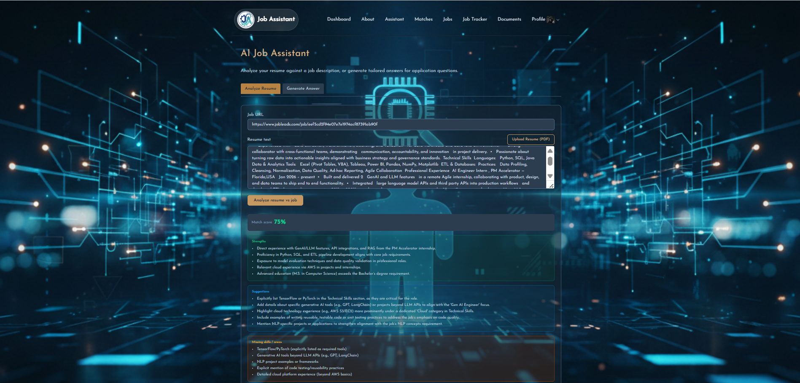
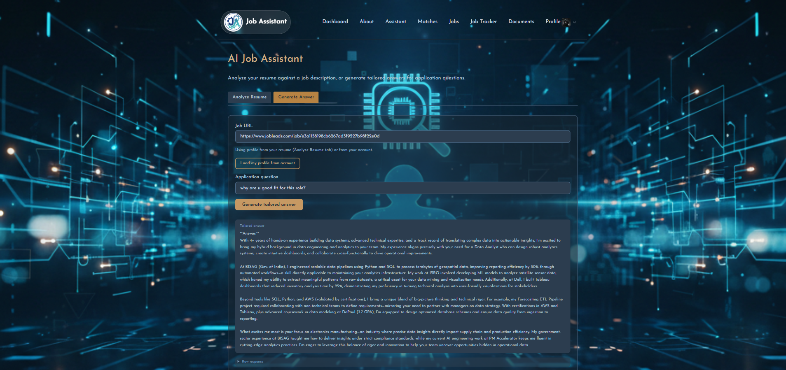

# AI-Powered Job Application Assistant (Starter)

Production-ready starter for a Simplify Copilot–inspired web app. Clean separation between frontend (Next.js) and backend (FastAPI) with room for AI agents, auth, and dashboards.

## Frontend (Next.js, TypeScript, Tailwind)
- `src/app/(auth)`: Auth surface JWT wiring pending.
- `src/app/dashboard|applications|resume|profile`: Dashboard-first pages for the four pillars.
- `src/components/layout`: `AppShell` and `Sidebar` keep navigation consistent.
- `src/components/ui`: Reusable UI primitives start with `Card`).
- `src/services`: API client helpers centralize base URL env.
- `src/lib`: Shared constants or utilities.
- `src/types`: Shared TypeScript models for API contracts.

### Notes
- App Router, typed pages, and Tailwind for rapid SaaS UI iteration.
- Sidebar-first layout mirrors simplify.jobs and opilot UX philosophy.
- Wire API calls through `services or apiClient` to keep fetch logic centralized.


### Screenshots
#### Home Page

<details>
  <summary>Click to view more screenshots</summary>
  
  
  
  
  
   
</details>

## Backend - FastAPI
- `api/main.py`: FastAPI app, CORS, router registration.
- `api/routes`: HTTP surface (`auth`, `jobs`, `health`). Keep routes thin.
- `api/dependencies`: Shared FastAPI dependencies (DB session, auth guards).
- `api/database`: Engine + session factory; env-driven Postgres URL.
- `api/models`: ORM models (`User`, `Job`) on shared `Base`.
- `api/schemas`: Pydantic request or response contracts.
- `api/services`: AI layer placeholder—keep heavy logic out of routes.
- `main.py` repo root: Entrypoint alias for `uvicorn`.

### Notes
- JWT-ready auth scaffold using `python-jose` and `passlib[bcrypt]`.
- Clear lane for AI logic via `api/services` so routes stay composable/testable.
- `render.yaml` configured to serve `api.main:app` on Render.

## Environment
- Frontend: `NEXT_PUBLIC_API_URL` points to FastAPI base URL.
- Backend: `PG_*` vars for Postgres, `AUTH_SECRET_KEY`, `AUTH_ALGORITHM`, and any AI provider keys.
- **LLM (OpenAI-compatible):** `OPENAI_API_KEY`, `OPENAI_MODEL`; optional `OPENAI_BASE_URL` for Azure/other providers.

### Using Azure AI Foundry + DeepSeek R1 
Set `OPENAI_BASE_URL`, `OPENAI_API_KEY`, and `OPENAI_MODEL=DeepSeek-R1` in `ai_job_backend/.env` after deploying DeepSeek R1 in [Microsoft Foundry](https://ai.azure.com). Step-by-step: **[AZURE_DEEPSEEK_SETUP.md](AZURE_DEEPSEEK_SETUP.md)**.

## Running locally
```bash
# Backend
cd ai_job_backend
pip install -r requirements.txt
uvicorn api.main:app --reload

# Frontend
cd ai_job_frontend
npm install
npm run dev
```

## Future hooks
- Autofill Agent: store profile data and surface in applications.
- Resume↔JD Scoring: service layer in `api/services` + UI in `resume/`.
- Tailored Answers: connect to AI provider; render in `applications/`.
- Tracking Dashboard: persist app states in Postgres; display in `dashboard/`.
