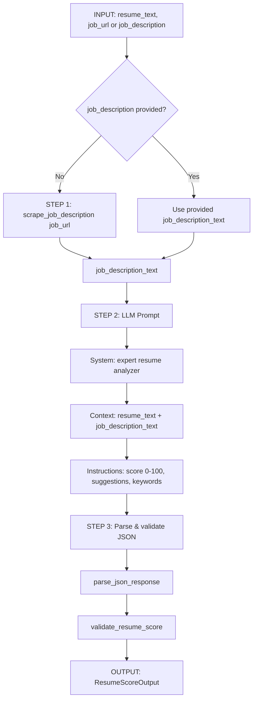
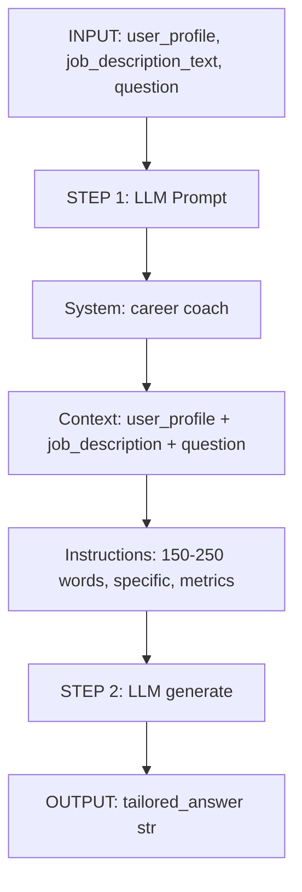

# AI Job Assistant – Data Science Design (Senior Data Scientist Todo)

This document covers **Phase 1: Preparation & Design** and aligns the codebase with the Senior Data Scientist todo (tech stack, agentic workflows, data contracts, API interface).

> **See also:** [AGENTIC_WORKFLOWS_DESIGN.md](../AGENTIC_WORKFLOWS_DESIGN.md) for the full specification of tools, data, and LLM prompting strategies.

---

## 1. Technology Stack Research

### 1.1 Web Scraping Libraries

| Library | Role in project | Pros | Cons |
|--------|------------------|------|------|
| **Beautiful Soup 4 (bs4)** | HTML parsing, clean text from raw HTML | Simple API, good for static HTML | No JS rendering |
| **Scrapy** | Not used directly | Robust, async, pipelines | Heavier; JS sites need middleware |
| **Playwright** | Primary for LinkedIn/Glassdoor (JS-heavy) | Headless browser, JS rendering | Needs BROWSERLESS_URL or local Chromium |
| **Selenium** | Optional fallback | Mature, many drivers | Slower; more resource-heavy |
| **requests + bs4** | Generic job pages, fast path | No JS; quick for static pages | Fails on JS-only content |

**Implementation:** `model/job_scraper.py` uses **Beautiful Soup** for parsing, **requests** for static pages, and **Playwright** (or Selenium) when `BROWSERLESS_URL` is set for LinkedIn/Glassdoor. Site-specific selectors and cleaning live in `JobScraper`.

### 1.2 Agentic Frameworks

| Framework | Role | Justification |
|-----------|------|---------------|
| **LangChain** | Not required for current flows | Chains/agents add abstraction; our flows are linear (scrape → prompt → parse). |
| **LlamaIndex** | Not required | Best for RAG/query over docs; we do single-shot prompt + tools. |
| **SmolAgents** | Optional agent layer | Lightweight, OpenAI-compatible; used in `model/agents/` for tool-calling agent. |
| **Google ADK** | Optional (Gemini) | Documented in AGENT_FRAMEWORKS.md for multi-tool agents. |

**Decision:** Core intelligence is implemented with **direct tool use** (scraper + LLM + parsers/validators). **SmolAgents** is optional for a single agent that can choose when to scrape, analyze, or generate answers. No LangChain/LlamaIndex dependency for the core workflows.

### 1.3 Agentic Design Patterns

| Pattern | How we use it |
|---------|----------------|
| **Tool Use (function calling)** | Scraper = tool (`scrape_job_description`); resume analyzer and answer generator = tools. Optional SmolAgents agent exposes these as tools to the LLM. |
| **Planning (ReAct / Chain-of-Thought)** | Not used explicitly; workflows are fixed: scrape → analyze, or prompt → generate. LLMs can still reason in-step (e.g. DeepSeek R1). |
| **Structured output** | Resume scorer returns JSON; we use prompt engineering + `parse_json_response` + `validate_resume_score` for a strict contract. |

---

## 2. Agentic Workflow Design

### 2.1 Resume Scorer Workflow



**Steps:**

1. **Input:** `resume_text` (str), `job_url` (str) or `job_description` (str).
2. **Step 1:** If no `job_description`, call `scrape_job_description(job_url)` → `job_description_text`.
3. **Step 2:** LLM prompt (system + context + instructions) from `prompts.RESUME_SCORER_PROMPT`.
4. **Step 3:** `parse_json_response(response)` → raw dict; `validate_resume_score(raw)` → `ResumeScoreOutput`.
5. **Output:** `{"score", "match_percentage", "suggestions", "matched_keywords", "missing_keywords"}`.

### 2.2 Tailored Answer Workflow



**Steps:**

1. **Input:** `user_profile` (dict), `job_description` (str), `question` (str).
2. **Step 1:** LLM prompt from `prompts.TAILORED_ANSWER_PROMPT`.
3. **Step 2:** Single LLM call; no parsing (free-form text).
4. **Output:** `tailored_answer` (str).

---

## 3. Data Contracts

### 3.1 Input: UserProfile

Used for tailored answers and (optionally) resume extraction.

```python
# model/contracts.py (TypedDict)
UserProfile = {
    "work_history": [
        {
            "company": str,
            "position": str,
            "duration": str,
            "responsibilities": [str],
            "achievements": [str]
        }
    ],
    "skills": [str],
    "education": [
        {
            "institution": str,
            "degree": str,
            "field": str,
            "graduation_year": int
        }
    ],
    "certifications": [str],
    "summary": str
}
```

**API:** Backend accepts a looser dict (e.g. `work_history` as string, `skills` as list or string); we normalize for the prompt. See `model/contracts.py` for the canonical schema and normalization.

### 3.2 Output: ResumeScoreOutput

```python
# model/contracts.py
ResumeScoreOutput = {
    "score": int,              # 0-100
    "match_percentage": float, # 0.0-1.0
    "suggestions": [
        {
            "category": str,    # "skills" | "experience" | "keywords"
            "suggestion": str,
            "priority": str     # "high" | "medium" | "low"
        }
    ],
    "matched_keywords": [str],
    "missing_keywords": [str]
}
```

**Backward compatibility:** Existing API also returns `strengths` and `missing_skills`; validators can coerce legacy LLM output into this shape and optionally keep extra fields.

### 3.3 Scraper Output

Current contract: `scrape_job_description(url)` returns **plain text** (full page or main content). Optional structured extraction (title, company, description, requirements) can be added later; see `job_scraper.py` and API route `/api/job/scrape` (returns `{"success", "text", "url"}`).

### 3.4 API Interfaces for Backend

| Endpoint | Input | Output |
|----------|--------|--------|
| `POST /api/resume/analyze` | `resume_text`, `job_url` or `job_description` | `ResumeScoreOutput`-shaped dict (+ optional `strengths`, `missing_skills`) |
| `POST /api/generate/answer` | `question`, `user_profile`, `job_url` or `job_description` | `{"answer": str}` or `{"success", "answer"}` |
| `POST /api/job/scrape` | `job_url` | `{"success", "text", "url"}` |
| `POST /api/resume/extract` | `resume_text` | `{"success", "work_history", "skills", "education", "additional_info"}` |

---

## 4. Module Layout (Phase 2)

```
ai_job_backend/model/
├── __init__.py
├── agents.py           # Orchestration: analyze_resume_and_jd, generate_tailored_answer
├── job_scraper.py      # Scraping (existing)
├── prompts.py          # RESUME_SCORER_PROMPT, TAILORED_ANSWER_PROMPT
├── parsers.py          # parse_json_response
├── validators.py       # validate_resume_score
├── contracts.py        # UserProfile, ResumeScoreOutput (TypedDict / Pydantic)
├── resume_analyzer.py  # Uses prompts, parsers, validators; returns ResumeScoreOutput
├── answer_generator.py # Uses TAILORED_ANSWER_PROMPT
├── job_assistant_service.py  # High-level service (existing)
├── utils/
│   ├── config.py
│   └── logging_config.py
└── tests/
    ├── test_scraper.py
    ├── test_parsers.py
    ├── test_validators.py
    └── test_agents_integration.py  # Optional: mock LLM
```

---

## 5. Configuration & Best Practices

- **Env:** `OPENAI_API_KEY`, `OPENAI_BASE_URL`, `OPENAI_MODEL`; `BROWSERLESS_URL` for LinkedIn/Glassdoor. See `model/utils/config.py` and `AZURE_DEEPSEEK_SETUP.md`.
- **Temperature:** 0.3 for resume scoring (structured); 0.7 for tailored answers (creative).
- **Logging:** Use `logging` in scraper, parsers, validators, agents (no bare `print` in production).
- **Errors:** Scraper and LLM errors return structured `{"success": False, "error": "..."}` or raise with clear messages; backend catches and returns HTTP 4xx/5xx.
- **Scale:** Rate limiting in API (`slowapi`); optional caching for repeated scrapes per URL (not implemented in base).

---

## 6. Deliverables Checklist (from Todo)

### Documentation
- [x] Architecture diagram of agentic workflows (this doc, Mermaid)
- [x] Data contracts specification (UserProfile, ResumeScoreOutput, API table)
- [x] Integration guide for backend (API interfaces, module layout)
- [x] API documentation (endpoint table above)

### Code
- [x] `job_scraper.py` – existing; robust scraping
- [x] `prompts.py` – RESUME_SCORER_PROMPT, TAILORED_ANSWER_PROMPT
- [x] `agents.py` – orchestration entry point (scrape → resume_analyzer → ResumeScoreOutput)
- [x] `parsers.py` – parse_json_response
- [x] `validators.py` – validate_resume_score
- [x] `contracts.py` – data contract types (UserProfile, ResumeScoreOutput)
- [x] Test suite: `model/tests/test_parsers.py`, `model/tests/test_validators.py`

### Testing
- [ ] 5+ job sites documented (LinkedIn, Indeed, Greenhouse, Lever, company pages)
- [ ] Prompt consistency > 90% for JSON (tracked via validators + tests)
- [ ] Error handling covers timeouts, 404s, invalid JSON
- [ ] Integration examples (see model/tests and api_integration)
